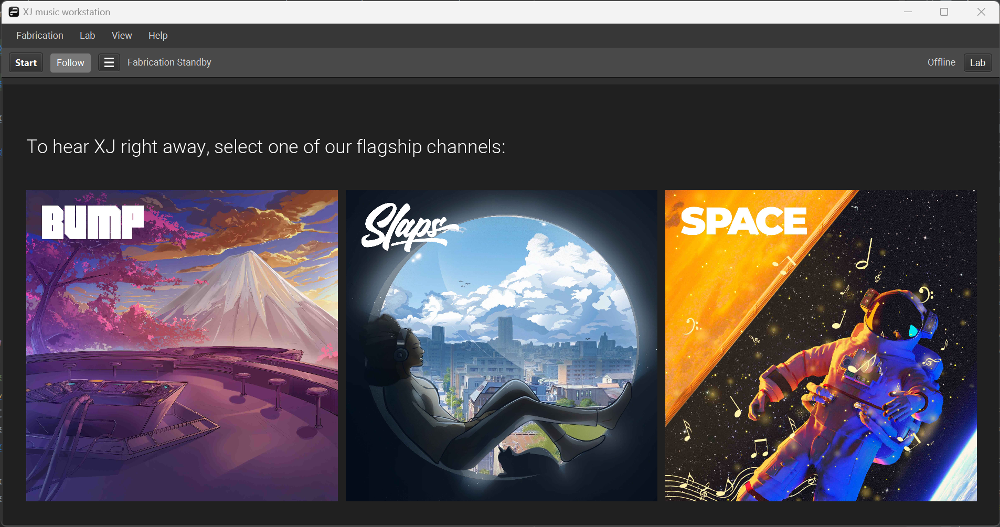

# XJ music

XJ music enables composers to realize new possibilities in dynamic music for video games.

The platform comprises the [XJ music workstation](workstation/README.md) for music composition and the 
[XJ music engine](engine/README.md) for implementing music in your game.

*Copyright (c) XJ Music Inc. All Rights Reserved.*

[U.S. Patent 10,446,126](https://patents.google.com/patent/US10446126B1/)

[xjmusic.com](https://xjmusic.com)

## Art

See the **art/** folder. By Accessing the contents of that folder, you agree to these terms:

> Please only read these files on your machine and then delete. Please do Not email that file anywhere, or upload it to
> any other servers. These files are confidential property of XJ Music Inc.

See specifically,
the [XJ music User Guide](https://docs.google.com/document/d/1Jp1DT7jJ3Xn1pR5495Yh4TeStTGanvuCF1du0uEUy1A/)

## Workflow Standards

### Axioms

* Any network connection can and will fail.
* There are no launches, pertaining instead only to the spanning of time, and the availability of said platform and its
  components.
* The platform does not implement passwords; it relies on OAuth.
* The platform does not send or receive email; it relies on vendors for all external communications.

### Writing

* Describe features as the desire of a person to take an action for a particular reason, e.g. "Artist wants Sequence and
  Pattern to be named according to musical norms, in order to make the most sense of XJ as a musical instrument."
* Describe bugs as expectation versus actual, e.g. "Artist expects to be able to list Audios after deleting an Audio
  from an Instrument," then:
  - DESCRIBE LIKE THIS: "I clicked the button labeled 'Turn;' I expected the Earth to turn; actually, it stood still."
  - NOT LIKE THIS: "I click the button and nothing happened."
* Commits reference issues by id #.
* Time is tracked against issues by id #.
* Branches are named according to `git-flow` including issue id #, e.g.:
  - Features are `feature/123-do-new-thing`
  - Bug Fixes are `bugfix/4567-should-do-this`
  - Hot Fixes are `hotfix/890-should-do-that`
* `TODO` comments are used only in working branches. Upon completion of branch shipWork, any remaining `TODO` should be
  a new tracker issue.

