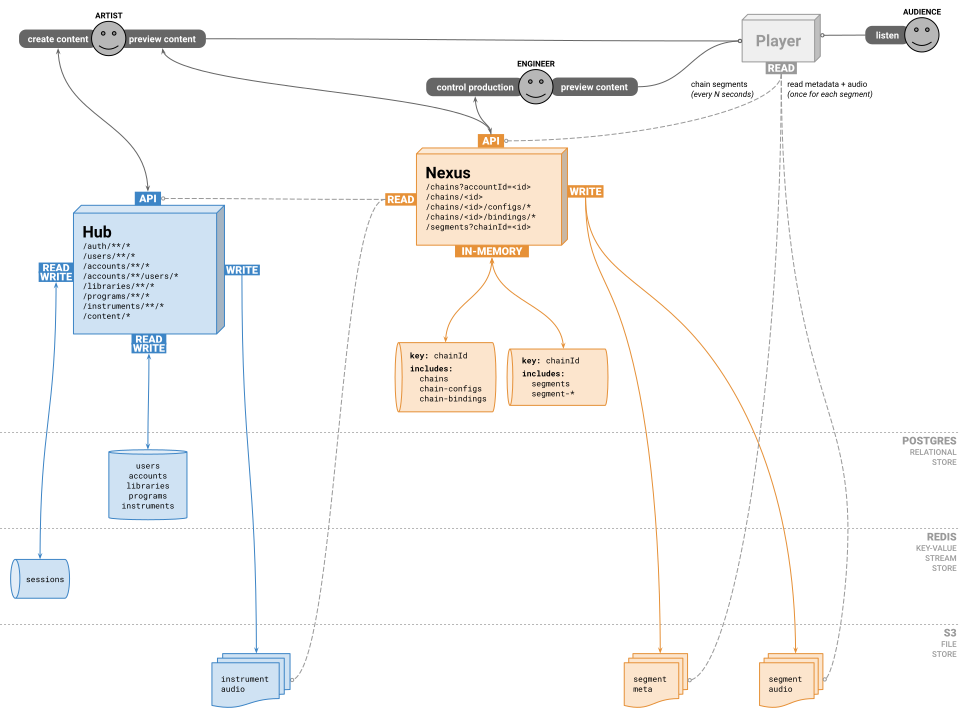

# XJ Music™ platform backend services

*Copyright (c) XJ Music Inc. (https://xj.io) All Rights Reserved.*


## Art

See the **/art** folder. By Accessing the contents of that folder, you agree to these terms:

> Please only read these files on your machine and then delete. Please do Not email that file anywhere, or upload it to 
> any other servers. These files are confidential property of XJ Music Inc.


### Architecture

Here's the general architecture of the XJ Music platform backend services. [(Download PDF)](art/XJMk3StreamingSegmentsArchitecture.pdf) 




## Axioms
  * Any network connection can and will fail.
  * There are no launches, pertaining instead only to the spanning of time, and the availability of said platform and 
    its components.
  * The platform does not implement passwords; it relies on OAuth.
  * The platform does not send or receive email; it relies on vendors for all external communications.
  
  
## Workflow
  * Features are described as the desire of a person to take an action for a particular reason, e.g. "Artist wants 
    Sequence and Pattern to be named according to musical norms, in order to make the most sense of XJ as a musical 
    instrument."
  * Bugs are described as expectation versus actual, e.g. "Artist expects to be able to list Audios after deleting an 
    Audio from an Instrument," then:
    - DESCRIBE LIKE THIS: "I clicked the button labeled 'Turn;' I expected the Earth to turn; actually, it stood still."
    - NOT LIKE THIS: "I click the button and nothing happened."
  * Commits reference issues by id #.
  * Time is tracked against issues by id #.
  * Branches are named according to `git-flow` including issue id #, e.g.:
    - Features are `feature/123-do-new-thing`
    - Bug Fixes are `bugfix/4567-should-do-this`
    - Hot Fixes are `hotfix/890-should-do-that`
  * `TODO` comments are used only in working branches. Upon completion of branch work, any remaining `TODO` should be a 
    new tracker issue.


## Dependencies
  * Java 11
  * Gradle (6+ via SDKMAN!)
  * Docker
  * Docker-compose
  * Postgres client tools (apt `postgresql-client-12`)
  * Redis client tools (apt `redis-tools`)
  * FDK AAC native libraries (apt `libfdk-aac-dev`)


## Service Ports

Each service has a unique port assignment:

| Service       | Port          |
| ------------- |---------------|
| hub           | 8042          |
| nexus         | 8043          |


## Web UI

https://github.com/xjmusic/web-ui


## Chain Work

This term refers (in the **xj** universe) to a layer of work performed on the Segments (sequentially, by their offset) 
in a Chain.


## Getting Started

We use [Docker](https://www.docker.com/) and [Docker Compose](https://docs.docker.com/compose/) for local development.

First, you'll use `docker-compose` to bring up the Postgres and Redis databases:

```bash
docker-compose up -d postgres redis
```

There is a convenience script to reset the Postgres database to a proper known state right away. You'll need to have
the `postgres-client` aka `psql` tool installed on your local machine for connecting to the database. Run:

```bash
bin/sql/reset/all_local
``` 

There is an example configuration called **env.example.conf** in the root of the project. It is up to you, the 
developer, to obtain keys and fill in the values of your own environment variables, in a new file called **env.conf** 
which is never checked in to version control or released with the distribution. So, the use of environment variables is 
federated across development and production deployments, while all actual configurations are kept outside the scope of 
the code.

Once your **env.conf** file is configured, it's time to bring up the `hub01xj1` server and its supporting resources such 
as `postgres01xj1` and `redis01xj1`:

    docker-compose up -d

In the above example, `-d` tells Docker to start the containers in the background (as Daemons).

Note that `localhost` simply points to the local loopback. Docker-compose maps maps local port 80 to the `hub01xj1` 
docker container port 80.

To compile the Java server-side applications and package them for deployment:

    gradle clean assemble

To build and deploy the platform during local development, we run this a lot:

    gradle assemble && docker restart hub01xj1 nexus01xj1

For a complete rebuild, including configurations and front-end, we could run:

    docker compose up -d --build

The data on `postgres01xj1` and `redis01xj1` persists until those containers are explicitly destroyed.

Tail the docker container logs for the `hub` app while it's running (/var/log in the container is mounted from local 
volume ./log):

    tail -f log/hub/*

Or tail container logs for the `nexus` app:

    tail -f log/nexus/*

You'll need to install the Postgresql client `psql` version 12, e.g. `postgresql-client-12` (ubuntu linux)

After logging in via Google, there will be a user created for you. It will have an `id`, for example 21. To grant the 
`admin` user role, you'll connect directly to the database on `postgres01xj1` using the port forwarding from local 
port 5400 (to Docker Postgres container port 5432):

    psql -h localhost -p 5400 -u root

Even better than ^^^, there's a convenience script to easily connect to the Postgres database in the Docker container.

    bin/sql/connect

And inside psql shell, for example to impersonate user #1 (after being auto-logged-in as new user #21):

    use xj;
    update user_auth set user_id=1 where user_id=21;
    
There's a convenience script to instantly perform the above operation:

    bin/sql/user_auth

Only between major platform configuration changes, it may be necessary to force Docker to rebuild the container 
using `--build`:

    docker-compose up -d --build    

There is a Postgresql dump of a complete example database, for quickly bootstrapping a dev environment. These files 
are located in `ops/sql/dump/*`:

Load the example database into `postgres01xj1` using the port forwarding from local port 5400 (to Docker Postgres 
container port 5432). There's a convenience script to do this:

    bin/sql/reset/all_local

The `/ops/sql/dump/*` files can be quickly updated from the current dev database with this script:

    bin/sql/dump/all_local

*note that the latest codebase may run migrations on top of that ^^^, and of course it had better pass checksum ;)*
This means you can never change the contents of any of your hubMigration .sql files after production hubMigration is done.

You may ask Gradle to migrate the Hub service's Postgres database at any time like this:

    gradle :service:hub:flywayMigrate --info  

It is NOT necessary to have any local Postgres server running. The build process will use your Docker `postgres01xj1`, 
or more specifically (for cross-platform compatibility) it will use port 5400 which Docker maps to `postgres01xj1` 
port 5432, for Maven to use during the build process.

Connect to the Docker `postgres01xj1` server:

    bin/sql/connect


## Additional commands

To only setup the workflow and check dependencies:

    bin/setup


## App Configuration

There is an example configuration called **env.example.conf** in the root of the project. It is up to you, the 
developer, to obtain keys and fill in the values of your own environment variables, in a new file called **env.conf** 
which is never checked in to version control or released with the distribution.  Developers modify their local 
**env.conf** file with private keys and configuration. The **env.conf** file is never committed to the repository, 
because it contains secrets. The **env.example.conf** file is kept up-to-date with all environment variables required 
for the developer to configure.


## Run local platform in Docker containers

Before running the docker container, be sure to package the latest Java build artifacts, with `make` or `bin/assemble`.

Bring up the `hub01xj1` docker container and its required resource containers:

    docker-compose up -d

The `-d` option above runs containers as background daemons, instead of seeing all their `stdin`. Use `docker-compose` 
or `docker` to manage containers from there.

To see running containers:

    docker ps --format

To attach to a container by `<name>`:

    docker attach <name>

To stop all containers:

    docker-compose down

To remove all containers:

    docker-compose rm

To bring up containers with a forced build:

    docker-compose up --build

To run just the `hub01xj1` container, attached via tty:

    docker-compose run xj

The configuration uses volumes such that the latest build artifacts are available without having to rebuild the docker 
container. The container runs as user `root` by default. Project folders are available inside the container as:

    /var/app/current/


## Compile server-side platform

Compile & Package the Java server-side application, e.g. as JAR files:

    gradle clean assemble


## Postgres database

By default, you'll need to create two Postgres databases:

  * `xj_dev` (for running services)
  * `xj_test` (for build processes, and running integration tests)


## Redis server

The docker container `redis01xj1` exposes a Redis server on local port 6300.  There's a convenience script for connecting to it:

    bin/redis_cli

For more information on Redis and production, see [the README in the ops/redis/ folder](ops/redis/README.md).


## Integration testing

Run all tests with Gradle

    gradle test

Integration uses the Docker `postgres01xj1` and `redis01xj1` databases.


## Database hubMigration

Each service is responsible for migrating its private stores when it starts up.


## Run local platform manually

Run a local **Hub** service on its default port 8042:

    bin/hub    

Run a local **Chains** service on its default port 8045:

    bin/chains


## Cleanup

Clean all build targets:

    gradle clean


## Maven

To clean and build all artifacts:

    gradle clean compileJava

To clean, build, test and assemble artifacts for shipment:

    gradle clean test assemble


## Google Authentication

Login to the app using Google authentication. The redirect URL for local development is http://xj.io/auth/google/callback


## Debugging

It is helpful to be able to compile and run Java components against the Docker container resources made available by Docker Compose. Assuming that the containers are running locally and addressed properly (see the 'DNS' section above) simply include the following in the Run Configuration -> Program Arguments:

    -Dapp.url.base=http://localhost:8042/
    -Dapp.url.api=
    -Dauth.google.id=<dev google oauth client id>
    -Dauth.google.secret=<dev google oauth client secret>
    -Ddb.postgresql.host=postgres01xj1
    -Ddb.redis.host=redis01xj1

Also remember, it is necessary to send an authentication cookie in the header of API requests:

    curl -b Access-Token


## Audio File Uploading

Note that after an audio file is uploaded, it can be played back (on a GNU/Linux system) like:

    curl https://s3.amazonaws.com/xj-dev-audio/62536d52-8600-4941-ac04-a72106079610-instrument-5-audio.wav | aplay

Here are the public-facing Amazon CloudFront-backed URLs for audio files, and their respective Amazon S3 backing:

  * [https://audio.xj.io](https://audio.xj.io) is the production URL, backed by [https://xj-prod-audio.s3.amazonaws.com](https://xj-prod-audio.s3.amazonaws.com)
  * [https://audio.stage.xj.io](https://audio.stage.xj.io) is the staging URL, backed by [https://xj-stage-audio.s3.amazonaws.com](https://xj-stage-audio.s3.amazonaws.com)
  * [https://audio.dev.xj.io](https://audio.dev.xj.io) is the development URL, backed by [https://xj-dev-audio.s3.amazonaws.com](https://xj-dev-audio.s3.amazonaws.com)


## Amazon S3

The `/ops/sql/dump/*` files are generated from data in the production environment, and refer to audio files located in the dev S3 bucket (synced from the production S3 bucket), xj-dev-audio.

Therefore, it is helpful to be able to sync the audio files from production into the dev environment.

**Note that this command will become impractical if production grows to any significant size!**

    aws s3 sync s3://xj-prod-audio/ s3://xj-dev-audio/

Note that in order to use that command, the source bucket (xj-prod-audio) must grant `s3:ListBucket` and `s3:GetObject` permission, and the target bucket (xj-dev-audio) must grant `s3:ListBucket` and `s3:PutObject` to the IAM user your AWS CLI is authenticated as.


## Library

Contained in the **[lib](lib/)** folder, these shared modules are dependencies of the XJ Music™ platform backend services built with Java.

**Craft** fabricates a musical audio composite from source sequences and instrument-audio. Built with Java, Guice, Tomcat, Maven.

**Dub** mixes and ships finished audio data to delivery. Built with Java, Guice, Tomcat, Maven.

**Mixer** is a Java implementation of the Go project [https://github.com/go-mix/mix](go-mix).

**Music** is a Java implementation of the Go project [https://github.com/go-music-theory/music-theory](go-music-theory).

A **Note** is used to represent the relative duration and pitch of a sound.

The **Key** of a piece is a group of pitches, or scale upon which a music composition is created in classical, Western art, and Western pop music.

A **Chord** is any harmonic set of three or more notes that is heard as if sounding simultaneously.

A **Scale** is any set of musical notes ordered by fundamental frequency or pitch.


## Services

Contained in the [service](service/) folder.


### hub

Central structured data and business logic. Built with Java.

Depends on `lib` components

Connects to:

  * SQL Database
  * Redis Database
  * S3 Filesystem
  
  
### chains

Central structured data and business logic. Built with Java.

Depends on `lib` components

Connects to:

  * Redis Database
  * S3 Filesystem

Expects a `POST /heartbeat` every 60 seconds with a `key` in order to ensure platform-wide vitals.

There's a convenience script to send cURL to Hub and trigger heartbeat in development:

    bin/heartbeat


### pulse

This app exists solely to be run in AWS Lambda, and call the Hub /heartbeat endpoint once per minute.


## Healthcheck Endpoint

**GET /o2**


## Intro to Google OAuth2

https://developers.google.com/+/web/samples/java


## Intro to Jersey and Grizzly2

See [Java SE 8: Creating a Basic REST Web Service using Grizzly, Jersey, and Maven](http://www.oracle.com/webfolder/technetwork/tutorials/obe/java/griz_jersey_intro/Grizzly-Jersey-Intro.html)


## Jersey

[Latest User Guide](https://jersey.java.net/documentation/latest/user-guide.html)


## Musical debugging

This sql query confirms that all segments begin where the preceding one ended:

```
SELECT
  A.offset "prev_offset",
  B.offset "next_offset",
  TIMESTAMPDIFF(SECOND, A.end_at, B.begin_at) "gap"
  FROM segment A
  JOIN segment B ON B.offset = A.offset+1; 
```

This sql query will reveal if any of the segment lengths are wildly off, given their relative lengths and totals:

```
SELECT
  offset,
  json_extract(content, '$.type') AS "type",
  total,
  tempo,
  TIMESTAMPDIFF(SECOND, begin_at, end_at) AS "length_seconds",
  TIMESTAMPDIFF(SECOND, begin_at, end_at)/total AS "time_per_beat"
  FROM segment
  WHERE chain_id=10; 
```

## IntelliJ IDEA

Here's the official XJ Music Inc copyright Velocity template:

    Copyright (c) 1999-${today.year}, XJ Music Inc. (https://xj.io) All Rights Reserved.


## Docker run as non-root user

 - Add the docker group if it doesn't already exist:

        sudo groupadd docker

 - Add the connected user "$USER" to the docker group. Change the user name to match your preferred user if you do not want to use your current user:

        sudo gpasswd -a $USER docker

 - log out/in to activate the changes to groups.

## OSX

On OSX, because we are unable to connect to the container from the host, we are using the following workarounds, which are built in to the cross-platform workflow:

  * Local port 80 (e.g. http://localhost) is mapped to Docker container `hub01xj1` port 80
  * Local port 5400 is mapped to Postgres container `postgres01xj1` port 5432

Docker documentation: https://docs.docker.com/docker-for-mac/networking/#per-container-ip-addressing-is-not-possible
GitHub Open Issue: https://github.com/docker/for-mac/issues/155


## Troubleshooting the build

If you see an error having to do with destroying the build artifacts:

```text
> Task :service:hub:clean FAILED

FAILURE: Build failed with an exception.

* What went wrong:
Execution failed for task ':service:hub:clean'.
> java.io.IOException: Unable to delete directory '/home/charney/xj/alpha-platform/service/hub/build'
    Failed to delete some children. This might happen because a process has files open or has its working directory set in the target directory.
    - /home/charney/xj/alpha-platform/service/hub/build/distributions/hub-1.0.tar
    - /home/charney/xj/alpha-platform/service/hub/build/distributions
```

It may be necessary to change all the permissions so your user owns the working tree:

```bash
sudo chown -R $(id -u):$(id -g) .
```
