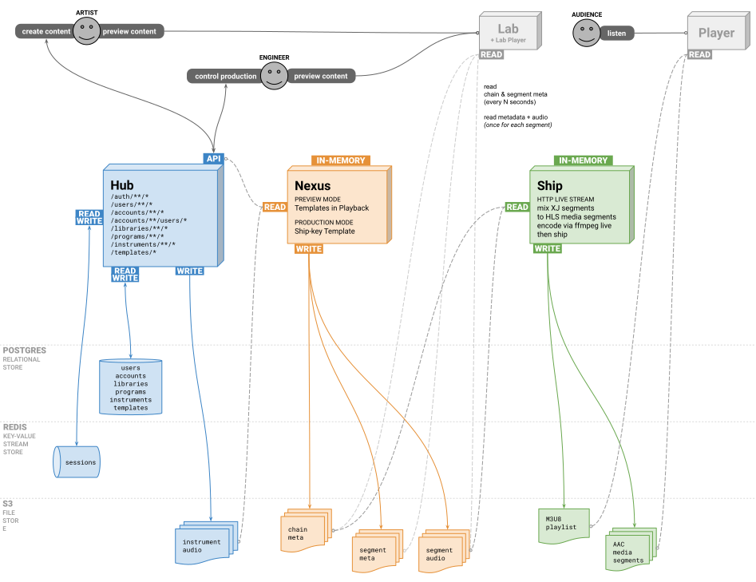
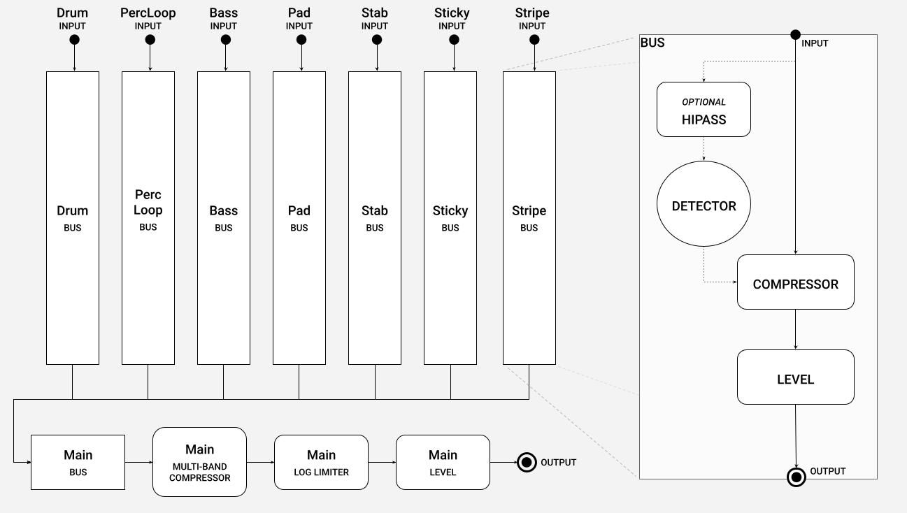

[](https://github.com/xjmusic/services/actions/workflows/dev.yml?branch=dev)

[](https://github.com/xjmusic/services/actions/workflows/main.yml?branch=main)

# XJ Music Backend (Java) Services

*Copyright (c) XJ Music Inc. (https://xj.io) All Rights Reserved.*

## Deployment

Just push to the `main` branch to deploy to Production CI, or `dev` branch for Development CI.

## Art

See the **/art** folder. By Accessing the contents of that folder, you agree to these terms:

> Please only read these files on your machine and then delete. Please do Not email that file anywhere, or upload it to
> any other servers. These files are confidential property of XJ Music Inc.

### Architecture

Here's the general architecture of the XJ Music platform backend services. [(Download PDF)](art/XJ
LabStreamingSegmentsArchitecture.pdf)





## Axioms

* Any network connection can and will fail.
* There are no launches, pertaining instead only to the spanning of time, and the availability of said platform and its
  components.
* The platform does not implement passwords; it relies on OAuth.
* The platform does not send or receive email; it relies on vendors for all external communications.

## Workflow

* Describe features as the desire of a person to take an action for a particular reason, e.g. "Artist wants Sequence and
  Pattern to be named according to musical norms, in order to make the most sense of XJ as a musical instrument."
* Describe bugs as expectation versus actual, e.g. "Artist expects to be able to list Audios after deleting an Audio
  from an Instrument," then:
  - DESCRIBE LIKE THIS: "I clicked the button labeled 'Turn;' I expected the Earth to turn; actually, it stood still."
  - NOT LIKE THIS: "I click the button and nothing happened."
* Commits reference issues by id #.
* Time is tracked against issues by id #.
* Branches are named according to `git-flow` including issue id #, e.g.:
  - Features are `feature/123-do-new-thing`
  - Bug Fixes are `bugfix/4567-should-do-this`
  - Hot Fixes are `hotfix/890-should-do-that`
* `TODO` comments are used only in working branches. Upon completion of branch shipWork, any remaining `TODO` should be a
  new tracker issue.

## Dependencies

* Java 16
* Gradle (6+ via SDKMAN!)

## Service Ports

Each service has a unique port assignment:

| Service       | Port          |
| ------------- |---------------|
| nexus         | 3000          |

## Chain Work

This term refers (in the **xj** universe) to a layer of shipWork performed on the Segments (sequentially, by their offset)
in a Chain.

## Getting Started

To compile the Java server-side applications and package them for deployment:

    gradle clean assemble

## App Configuration

There is an example configuration called **env.example.conf** in the root of the project. It is up to you, the
developer, to obtain keys and fill in the values of your own environment variables, in a new file called **.env**
which is never checked in to version control or released with the distribution. Developers modify their local
**.env** file with private keys and configuration. The **.env** file is never committed to the repository, because it
contains secrets. The **env.example.conf** file is kept up-to-date with all environment variables required for the
developer to configure.

## Integration testing

Run all tests with Gradle

    gradle test

## Cleanup

Clean all build targets:

    gradle clean

## Maven

To clean and build all artifacts:

    gradle clean compileJava

To clean, build, test and assemble artifacts for shipment:

    gradle clean test assemble

## Google Authentication

Login to the app using Google authentication. The redirect URL for local development
is http://xj.io/auth/google/callback

## Shipping final audio & JSON to Amazon S3

Note that after an audio file is uploaded, it can be played back (on a GNU/Linux system) like:

    curl https://s3.amazonaws.com/xj-dev-audio/62536d52-8600-4941-ac04-a72106079610-instrument-5-audio.wav | aplay

Here are the public-facing Amazon CloudFront-backed URLs for audio files, and their respective Amazon S3 backing:

* [https://audio.xj.io](https://audio.xj.io) is the production URL, backed
  by [https://xj-prod-audio.s3.amazonaws.com](https://xj-prod-audio.s3.amazonaws.com)
* [https://audio.stage.xj.io](https://audio.stage.xj.io) is the staging URL, backed
  by [https://xj-stage-audio.s3.amazonaws.com](https://xj-stage-audio.s3.amazonaws.com)
* [https://audio.dev.xj.io](https://audio.dev.xj.io) is the development URL, backed
  by [https://xj-dev-audio.s3.amazonaws.com](https://xj-dev-audio.s3.amazonaws.com)

**NOTE** that our CloudFront configuration defines two tiers of caching behavior:

* Files containing NO hyphen will have a short TTL, e.g. **coolambience.json** (this is the chain manifest that is
  updated frequently)
* Files containing a hyphen will have a long TTL, e.g. **coolambience-000012598722847.ogg** (this is a segment file that
  never changes)

## Amazon S3

Therefore, it is helpful to be able to sync the audio files from production into the dev environment.

     aws sync s3://xj-prod-audio/ s3://xj-dev-audio/

Note that in order to use that command, the source bucket (xj-prod-audio) must grant `s3:ListBucket` and `s3:GetObject`
permission, and the target bucket (xj-dev-audio) must grant `s3:ListBucket` and `s3:PutObject` to the IAM user your AWS
CLI is authenticated as.

## Library

**Craft** fabricates a musical audio composite from source sequences and instrument-audio. Built with Java, Guice,
Tomcat, Maven.

**Dub** mixes and ships finished audio data to delivery. Built with Java, Guice, Tomcat, Maven.

**Mixer** is a Java implementation of the Go project [go-mix](https://github.com/go-mix/mix).

**Music** is a Java implementation of the Go project [go-music-theory](https://github.com/go-music-theory/music-theory).

A **Note** is used to represent the relative duration and pitch of a sound.

The **Key** of a piece is a group of pitches, or scale upon which a music composition is created in classical, Western
art, and Western pop music.

A **Chord** is any harmonic set of three or more notes that is heard as if sounding simultaneously.

A **Scale** is any set of musical notes ordered by fundamental frequency or pitch.

## Telemetry

Contained in the `lib/telemetry` module.

### nexus

Central structured data and business logic. Built with Java.

Depends on `lib` components

Connects to:

* S3 Filesystem

### pulse

This app exists solely to be run in AWS Lambda, and call the Hub /heartbeat endpoint once per minute.

## Healthcheck Endpoint

**GET /healthz**

## Intro to Google OAuth2

https://developers.google.com/+/web/samples/java

## Intro to Jersey and Grizzly2

See [Java SE 8: Creating a Basic REST Web Service using Grizzly, Jersey, and Maven](http://www.oracle.com/webfolder/technetwork/tutorials/obe/java/griz_jersey_intro/Grizzly-Jersey-Intro.html)

## Jersey

[Latest User Guide](https://jersey.java.net/documentation/latest/user-guide.html)

## IntelliJ IDEA

Here's the official XJ Music Inc copyright Velocity template:

    Copyright (c) 1999-${today.year}, XJ Music Inc. (https://xj.io) All Rights Reserved.

## Troubleshooting the build

If you see an error having to do with destroying the build artifacts:

```text
> Task :hub:clean FAILED

FAILURE: Build failed with an exception.

* What went wrong:
Execution failed for task ':hub:clean'.
> java.io.IOException: Unable to delete directory '/home/charney/xj/alpha-platform/hub/build'
    Failed to delete some children. This might happen because a process has files open or has its working directory set in the target directory.
    - /home/charney/xj/alpha-platform/hub/build/distributions/hub-1.0.tar
    - /home/charney/xj/alpha-platform/hub/build/distributions
```

It may be necessary to change all the permissions so your user owns the working tree:

```bash
sudo chown -R $(id -u):$(id -g) .
```

# MP4 Encoding

### MP4 Fragment (reference)

Sequence offset 0 - generated by ffmpeg

[](ship/src/test/resources/chunk_reference_outputs/test5-128k-151304042-ffmpeg.yaml)

### Generated MP4 Fragment

```
SegmentTypeBox:
  majorBrand: msdh
  minorVersion: 0
  compatibleBrand: msdh
  compatibleBrand: msix

SegmentIndexBox:
  entries:
    - Entry:
        referenceType: 0
        referencedSize: 64690
        subsegmentDuration: 480000
        startsWithSap: 1
        sapType: 0
        sapDeltaTime: 0
  referenceId: 1
  timeScale: 48000
  earliestPresentationTime: 0
  firstOffset: 0
  reserved: 0

MovieFragmentBox:
  MovieFragmentHeaderBox:
    sequenceNumber: 1
  
  TrackFragmentBox:
    TrackFragmentHeaderBox:
      trackId: 1
      baseDataOffset: -1
      sampleDescriptionIndex: 0
      defaultSampleDuration: 1024
      defaultSampleSize: 111
      defaultSampleFlags: 
        - SampleFlags:
            reserved: 0
            isLeading: 0
            depOn: 2
            isDepOn: 0
            hasRedundancy: 0
            padValue: 0
            isDiffSample: false
            degradPrio: 0     
      durationIsEmpty: false
      defaultBaseIsMoof: true
    
    TrackFragmentBaseMediaDecodeTimeBox:
      baseMediaDecodeTime: 0
    
    TrackRunBox:
      sampleCount: 470
      dataOffset: 3868
      dataOffsetPresent: true
      sampleSizePresent: true
      sampleDurationPresent: true
      sampleFlagsPresentPresent: false
      sampleCompositionTimeOffsetPresent: false
      firstSampleFlags: null
    
  

org.mp4parser.boxes.iso14496.part12.MediaDataBox@720c8f80
```

# Base Docker Image for Nexus

Base Container required to ship Nexus as a container via jib


