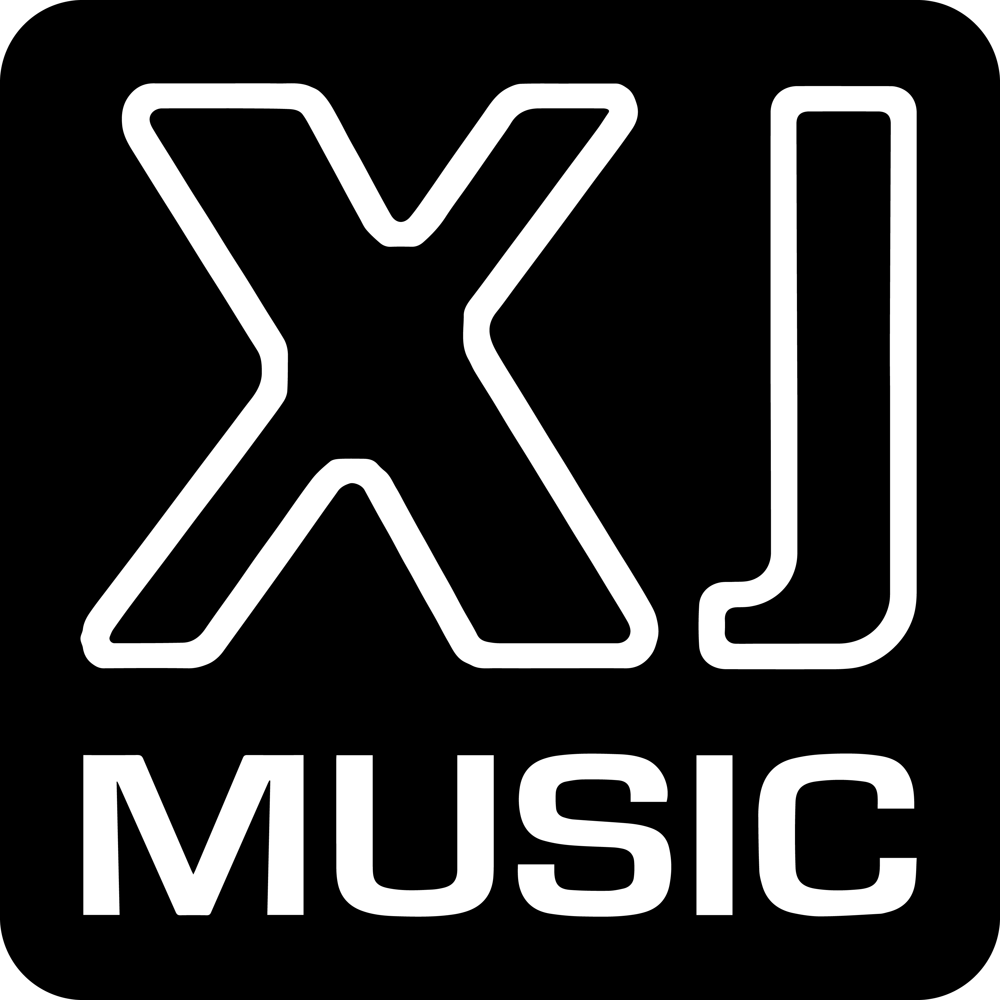

  

# Dynamic music engine

XJ music enables composers to realize new possibilities in dynamic music for video games.

The platform comprises the [XJ music workstation](workstation/README.md) for music composition and the 
[XJ music engine](engine/README.md) for implementing music in your game.

  
## Patented technology, open source codebase

The underlying technology is protected by [U.S. Patent 10,446,126](https://patents.google.com/patent/US10446126B1/)
You may use the XJ music engine completely free for projects with a budget under $250K.
For larger projects, contact licensing@xjmusic.com for a license.

## Getting XJ music

### Binary downloads

The latest version of the XJ music workstation can be downloaded from [xjmusic.com/download](https://xjmusic.com/download).

All official binaries for the XJ music engine and workstation can be found [in the releases section](https://github.com/xjmusic/xjmusic/releases)

### Compiling from source

[See the official docs](https://docs.godotengine.org/en/latest/contributing/development/compiling)
for compilation instructions for every supported platform.

## Community and contributing

Godot is not only an engine but an ever-growing community of users and engine developers.

The best way to get in touch with the core engine developers is to join the
[XJ music Discord](https://discord.xj.io).

To get started contributing to the project, see the [contributing guide](CONTRIBUTING.md).
This document also includes guidelines for reporting bugs.

## Documentation

The official documentation is published at [docs.xjmusic.com](https://docs.xjmusic.com).
It is maintained by the XJ music community in its own [GitHub repository](https://github.com/xjmusic/xjmusic-docs).
